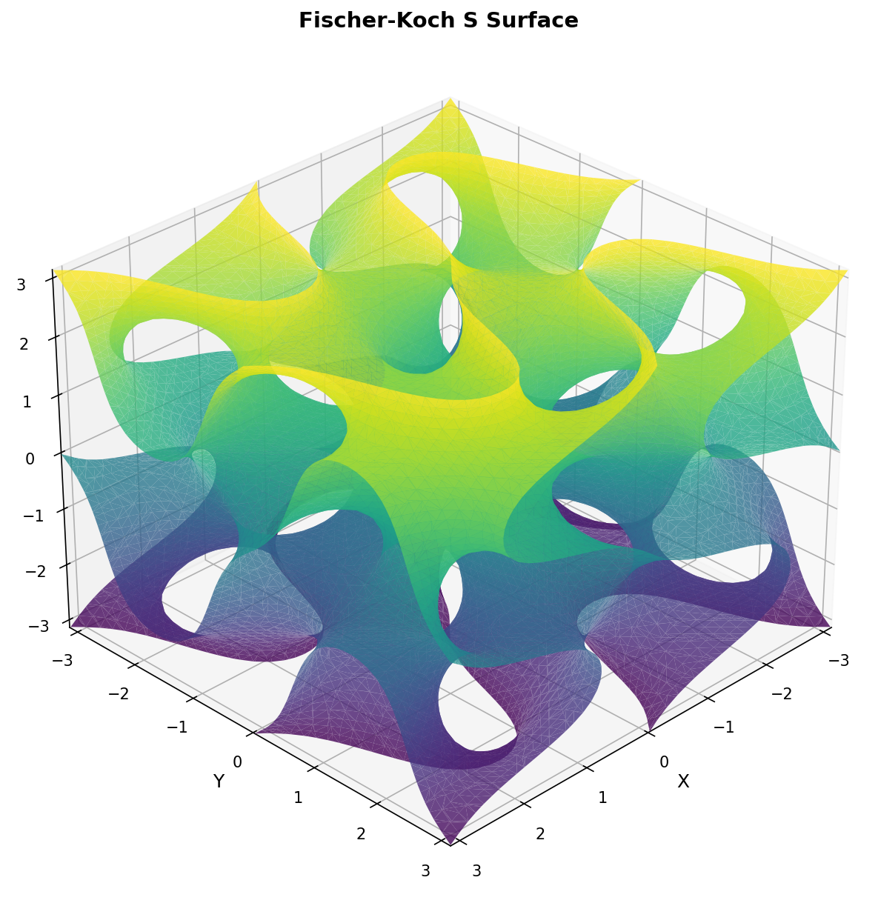

# Fischer-Koch S Surface Plotter

A Python visualization tool for the Fischer-Koch S triply periodic minimal surface (TPMS) using the approximated implicit equation.

## Overview

This project generates and visualizes the Fischer-Koch S surface, a fascinating mathematical structure with applications in engineering, architecture, and materials science. The surface is defined by an implicit trigonometric equation and exhibits remarkable properties including zero mean curvature and periodic structure in three dimensions.

## Mathematical Equation

The Fischer-Koch S surface is defined by the implicit equation:

```text
cos(2x)·sin(y)·cos(z) + cos(2y)·sin(z)·cos(x) + cos(2z)·sin(x)·cos(y) = 0
```

## Features

- **Interactive 3D Visualization**: Rotate, zoom, and pan the surface in real-time
- **Configurable Resolution**: Adjust mesh quality from 30 to 100 grid points
- **Export Capability**: Save high-quality images of the surface
- **Marching Cubes Algorithm**: Accurate isosurface extraction using scipy and scikit-image
- **Smooth Rendering**: Gaussian filtering for enhanced visual quality

## Installation

### Prerequisites

Install `uv` if you haven't already:

```sh
# On macOS and Linux
curl -LsSf https://astral.sh/uv/install.sh | sh

# On Windows
powershell -c "irm https://astral.sh/uv/install.ps1 | iex"
```

### Setup

1. Clone the repository:
```sh
git clone https://github.com/yourusername/fischer-koch-s-plotter.git
cd fischer-koch-s-plotter
```

2. Install dependencies (automatically handled by uv):
```sh
uv sync
```

## Usage

### Interactive Visualization

Run the interactive version with 3D controls:

```sh
uv run python fischer_koch_s.py
```

When prompted, enter a grid resolution (30-100). Higher values provide better quality but require more computation time.

**Controls:**

- **Left-click + drag**: Rotate the view
- **Right-click + drag**: Zoom in/out  
- **Middle-click + drag**: Pan the view
- **Close window**: Exit the program

### Save to File

Generate and save the surface to an image file:

```sh
uv run python fischer_koch_s_save.py
```

This creates `fischer_koch_s.png` in the current directory.

## Examples

The surface generation supports different parameters:

```python
# Generate with custom resolution
verts, faces = generate_surface(
    resolution=75,           # Higher resolution for better quality
    bounds=(-np.pi, np.pi),  # Coordinate bounds
    iso_value=0.0            # Isosurface level
)
```

## Applications

The Fischer-Koch S surface has numerous practical applications:

- **Heat Exchangers**: Maximum surface area for efficient heat transfer
- **Bone Tissue Engineering**: Scaffolds with optimal porosity and strength
- **Architectural Design**: Structurally efficient space-filling geometries
- **Filtration Systems**: Enhanced flow characteristics through periodic channels
- **Metamaterials**: Novel mechanical and optical properties
- **3D Printing**: Better mechanical properties than gyroid

## Dependencies

- **numpy**: Numerical computations
- **matplotlib**: 3D plotting and visualization
- **scipy**: Signal processing and filtering
- **scikit-image**: Marching cubes algorithm

## Technical Details

### Algorithm

1. **Grid Generation**: Creates a 3D grid of points
2. **Function Evaluation**: Computes the implicit equation value at each point
3. **Smoothing**: Applies Gaussian filter for improved surface quality
4. **Isosurface Extraction**: Uses marching cubes to generate triangle mesh
5. **Rendering**: Displays the mesh with shading and color mapping

### Performance

- Resolution 50: ~20,000 vertices, ~40,000 faces (< 2 seconds)
- Resolution 75: ~45,000 vertices, ~90,000 faces (< 5 seconds)
- Resolution 100: ~80,000 vertices, ~160,000 faces (< 10 seconds)

## References

- [Triply Periodic Minimal Surfaces](https://en.wikipedia.org/wiki/Triply_periodic_minimal_surface)
- Fischer, W. & Koch, E. (1987). "On 3-periodic minimal surfaces"
- [Applications in Heat Transfer](https://www.mdpi.com/1996-1073/17/3/688)
- [Bioengineering Applications](https://www.frontiersin.org/journals/bioengineering-and-biotechnology/articles/10.3389/fbioe.2024.1410837/full)

---

<p align="center">
  
</p>
